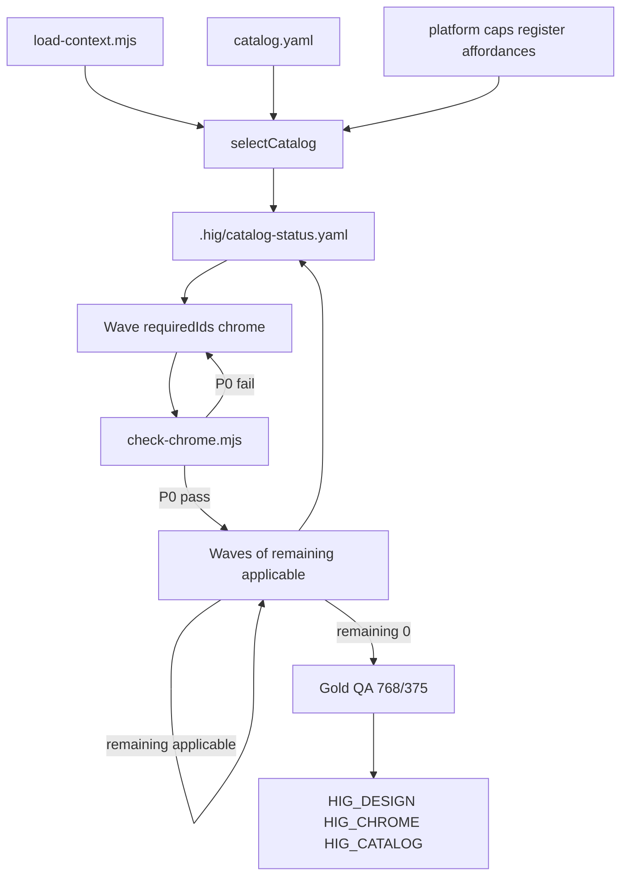
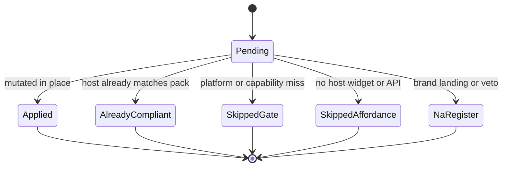

# Goal-Driven HIG Catalog Agent - Plan

**Canonical catalog-loop contract.** `ce-work` / later implementation must use this file, not the PR #12 lane-lock sketch `docs/plans/2026-09-21-hig-catalog-goal-agent.md`. That sketch freezes current apply (12 `requiredIds`, host fonts, no `catalog.yaml` in PR #12). This plan is the additive v0.5.0 loop.

## Goal Capsule

- **Objective:** `/hig` treats Apple’s Human Interface Guidelines article catalog as the backlog, selects what applies to this host, maps those rules onto the host’s existing widgets and typeface, and stops only when that applicable set is accounted for.
- **Authority:** Product Contract owns behavior. Planning Contract owns mechanism. Shipped `skills/hig/knowledge/catalog.yaml` owns article inventory (refreshed from Apple DocC at sync/upgrade). `skills/hig/knowledge/chrome/grammar.yaml` plus `skills/hig/scripts/check-chrome.mjs` own solved P0 chrome FAILs only. Host `DESIGN.md` owns brand color, typeface, and voice.
- **Stop when:** Product chrome has no P0 `check-chrome.mjs` fails, every catalog row is in a terminal status, and the run emits `HIG_CATALOG` derived from the loaded catalog (no magic integer in skill prose as the stop). Do not stop after the 12 required chrome surfaces or because watch/tv/vision rows exist.
- **Execution profile:** Eval-first skill change. Extend `eval/run-*.mjs` before changing the `/hig` contract. Do not mutate patient apps in this repo.
- **Tail ownership:** Plugin author-agents implement units in dependency order. `/hig` at patient-app time is the runtime agent this plan designs.
- **Landing:** Documentation may sit on the PR #12 branch. Implementing U1 and U3–U8 is a later catalog PR (v0.5.0), not chrome apply. U2 (host fonts) already landed on this branch and must not regress.

Product Contract preservation: Product Contract unchanged (bootstrap; no upstream brainstorm file).

Today’s live Apple DocC article count is **158** (2026-09-21, reconfirmed). That number is evidence for this plan’s honesty table. Runtime and evals load catalog length from YAML / the live index, and must not freeze `158` as a stop condition.

---

## Product Contract

### Summary

`/hig` is a goal-driven playbook agent. Apple’s HIG is hierarchy, chrome budget, materials-with-purpose, accessibility, and consistency — not San Francisco, not SwiftUI, not an injected kit. On any UI stack the agent maps those rules onto widgets the host already has and leaves the host typeface alone. The official article catalog is the work list. The 12 required surfaces and nine chrome FAIL IDs stay as the first P0 gate, not as the whole HIG.

### Problem Frame

v0.4.1 made chrome mechanically enforceable so a weak model cannot declare PASS. This branch already left unspecified product fonts with the host. Round 1 apply is still 12 `requiredIds` plus a three-round swarm. Live Apple DocC on 2026-09-21 lists 158 article topics. This plugin mentions ~107 of those URLs, launches 60 swarm surfaces, and typically applies 12. Chrome can pass while the rest of the playbook never runs. Fonts are no longer the gap. Catalog exhaustion is.

### Requirements

**Catalog as backlog**

- R1. `/hig` walks a shipped inventory of every current Apple HIG **article**, not only `surfaces.yaml` `requiredIds`.
- R2. Each article row records title, slug, Apple URL, group, gate / `appliesWhen`, optional cluster/surface, and pack path.
- R3. A `/hig` run selects the applicable subset for this host’s stack, platform, capabilities, register, and existing UI affordances.
- R4. After required chrome is P0-clean, the agent continues applying remaining applicable rows until each row is applied, skipped, or n/a. A wave lease cap is not catalog-done.
- R5. The run prints coverage derived from the loaded catalog: total, applicable, applied, skipped-gate, skipped-no-affordance, n/a-register, remaining.

**Playbook mapped to the host**

- R6. Apply in the host language through existing components and tokens. Do not inject a component library, CSS kit, or SwiftUI into non-Apple stacks.
- R7. Flutter, Vue, Svelte, Angular, Qt, and generic CSS hosts with `mutation=open` receive the same structural playbook via a host-map, not a new widget set.
- R8. Success is an outside reviewer saying the UI was designed to Apple’s HIG standard of structure, clarity, and restraint even when the face is Inter and the stack is Tailwind, Flutter, or Vue.
- R9. New catalog `failWhen` / `passWhen` lines are design rules. They must not name a framework or a font family as the pass condition. Mapping lives in `host-map.md`.

**Brand and typeface**

- R10. Host brand colors, fonts, and voice stay. Any typeface is valid.
- R11. Unspecified product fonts stay as the host already set them. `/hig` must not write SF Pro, a forced `-apple-system` stack, or any other default face.
- R12. Typography work is ramp, hierarchy, list-vs-detail density, and Dynamic Type / zoom — not family substitution.

**Chrome is a subset**

- R13. `grammar.yaml` + `check-chrome.mjs` remain the mechanical P0 gate for solved FAIL IDs. Passing them is necessary, not sufficient, for catalog done.
- R14. Soft pack prose still cannot emit `HIG_CHROME` PASS while P0 remains.
- R15. Chrome detectors key off `grammar.yaml` ids. Do not keep a second hardcoded copy of the FAIL id list in detector code.

**Platform catalog completeness**

- R16. Designing for watchOS, tvOS, and visionOS exist as gated catalog rows. A phone or web host skips them. Their existence must not shrink the agent design.
- R17. A topic with no host affordance (no chart, no slider, no Digital Crown) is `skipped-no-affordance`. The agent must not inject that widget.

**Plugin surgery vs runtime**

- R18. TypeSafe / Jev is not a `/hig` runtime dependency and is not called on the patient app.
- R19. Plugin maintainers may use Jev to classify new catalog rows (gate, cluster, priority). Missing API key falls back to Apple group + existing gate heuristics.

**Commands**

- R20. `/hig review` reports catalog coverage and chrome IDs. It does not auto-fix.
- R21. `/hig adapt` stays one surface or route. It does not require exhausting the catalog.
- R22. `/hig upgrade` may refresh the shipped catalog snapshot from Apple DocC. Patient `/hig` does not fetch Apple at runtime.

### Actors

- A1. Coding agent that runs `/hig` in a host repo.
- A2. apple-hig maintainer who ships catalog rows, packs, and evals.
- A3. Host product user (indirect). Sees structure change, not a new typeface or kit.

### Key Flows

- F1. Default `/hig` on a product UI host
  - **Trigger:** Bare `/hig`.
  - **Actors:** A1
  - **Steps:** Preflight. Write/refresh design artifacts without forcing a font. Select catalog. Wave required chrome until `check-chrome.mjs` P0-clean. Wave remaining applicable topics. Gold QA. Print `HIG_CATALOG`.
  - **Outcome:** Applicable HIG applied in place. Brand face unchanged.
  - **Covered by:** R1, R3, R4, R10, R11, R13
- F2. `/hig` on Flutter or Vue
  - **Trigger:** Preflight `kind=flutter` or `kind=vue`, `mutation=open`.
  - **Steps:** Same as F1. Host-map names Flutter/Vue/CSS equivalents. No React kit. No SwiftUI.
  - **Covered by:** R6, R7, R8, R9
- F3. `/hig` on a watchOS (or tvOS / visionOS) UI host
  - **Trigger:** Preflight platform matches watch (or tv, vision).
  - **Steps:** `designing-for-watchos` (or tv/vision) is applicable. Phone-only rows skip.
  - **Covered by:** R16
- F4. `/hig` on a web iPhone product with no watch APIs
  - **Trigger:** Typical React/CSS host.
  - **Steps:** Watch/tv/vision rows `skipped-gate`. Charts/sliders apply only if those controls exist.
  - **Covered by:** R16, R17
- F5. Interrupted run
  - **Trigger:** Context limit, user stop, or tool-unavailable serial fallback.
  - **Steps:** Persist `.hig/catalog-status.yaml`. Next `/hig` resumes remaining applicable rows.
  - **Covered by:** R4, R5
- F6. Unsupported host
  - **Trigger:** No UI surface.
  - **Steps:** Existing `mutation=unsupported` stop line. No catalog apply.
  - **Covered by:** existing preflight stop; no catalog mutation
- F7. `/hig review`
  - **Trigger:** Report-only.
  - **Steps:** Checker + catalog status + gold QA viewports. No mutation.
  - **Covered by:** R20, R13

### Acceptance Examples

- AE1. Inter product, unspecified DESIGN fonts
  - **Covers:** R10, R11, R12
  - **Given:** Product register, CSS `font-family: Inter`, no DESIGN font lock.
  - **When:** `/hig` runs.
  - **Then:** Inter remains. Hierarchy/ramp may change. Preflight does not introduce `appleTypeDefault` or write SF Pro.
- AE2. Does not stop at twelve
  - **Covers:** R1, R4
  - **Given:** Product host, chrome P0 already clean.
  - **When:** `/hig` continues.
  - **Then:** Remaining applicable catalog rows still launch (search, settings, loading, writing). The run does not print done after only `requiredIds`.
- AE3. No chart injection
  - **Covers:** R17
  - **Given:** Host has no chart widget and no charting library.
  - **When:** Catalog includes Charts / Charting data.
  - **Then:** Those rows are `skipped-no-affordance`. No chart component is added.
- AE4. Flutter mapping
  - **Covers:** R6, R7, R8, R9
  - **Given:** Flutter host, `mutation=open`.
  - **When:** `/hig` applies lists and navigation.
  - **Then:** Edits use Flutter widgets already in the project. No SwiftUI and no React kit appear. The catalog rule itself does not say “must use SwiftUI List.”
- AE5. Watch row present, web host
  - **Covers:** R16
  - **Given:** Web product, no watch target.
  - **When:** Catalog selection runs.
  - **Then:** `designing-for-watchos` is `skipped-gate`, not omitted from the shipped catalog, and not a FAIL on web.
- AE6. Chrome still blocks PASS
  - **Covers:** R13, R14
  - **Given:** Fashion glass on nav still in source.
  - **When:** A wave finishes.
  - **Then:** `HIG_CHROME` is not PASS. Optional catalog waves wait until P0 chrome is clean.

### Success Criteria

- Shipped catalog matches live Apple article slugs at last sync, with a recorded fetch date. Eval diffs against the index (or the pin) rather than asserting a literal `158` in detector source.
- A product host run accounts for every shipped row (applied or explicit skip/n/a).
- Brand and unspecified host fonts survive.
- Existing four eval harnesses still pass, plus a catalog harness.
- README/PROOF state the honest bar: HIG playbook on host widgets, not pixel-iOS and not 12-surfaces-equals-HIG.

### Scope Boundaries

**In scope**

- Catalog SSOT, selection, goal-driven waves, host-font regression guard, host-map, stub rows for Apple articles with no plugin URL today, coverage reporting, evals, docs.

**Deferred for later**

- Full prose distillation of every missing pack (stubs + Apple URL are enough to apply).
- Dedicated `hig-flutter` / `hig-vue` skills (host-map is the v1 bridge).
- Proof-gap chrome IDs in `docs/PROOF.md` (`split.empty-select`, list-width, short-vs-long create, list-status lifecycle).
- Pixel-accurate watch faces, Top Shelf, complications, Digital Crown haptics.
- Live patient visual evals on non-React apps.
- Authoring first-class watch/tv/vision **apply surfaces** (gated stub rows are in scope; dedicated apply workers are not).

**Outside this product’s identity**

- Cloning iOS chrome or San Francisco onto every app.
- Jev as a runtime designer inside `/hig`.
- A parallel component library.
- Forcing app shells onto `register: brand` landings.
- Claiming every git repo, including backends, becomes an Apple app.

### Product Key Decisions

- KD1. Fonts are brand/host-owned. Any face is fine. Governs R10, R11, R12.
- KD2. The official Apple article catalog is the backlog. Governs R1, R2, R4, R5.
- KD3. Beauty is HIG structure mapped to host widgets, any stack. Governs R6, R7, R8, R9.
- KD4. Mechanical chrome stays a P0 subset. Governs R13, R14, R15.
- KD5. Jev is plugin surgery, not `/hig` runtime. Governs R18, R19.
- KD6. Watch/tv/vision stay in the catalog as gates. Governs R16.

### Dependencies

- Apple DocC index: `https://developer.apple.com/tutorials/data/index/design--human-interface-guidelines` (sync-time only).
- Existing v0.4.1 chrome checker, recipes, requiredIds, eval fixtures, and host-font stay (`eval/run-dry.mjs` case `host-fonts-stay`).
- Optional `TYPESAFE_API_KEY` for maintainer classification; not required to run `/hig`.

---

## Planning Contract

### Assumptions

- Live article count is 158 as of 2026-09-21. The shipped file pins that snapshot. Sync may change the number. Runtime uses the pin’s length.
- “Applicable exhausted” means every row has a terminal status, not that every Apple widget was added.
- Wave size about 8–12 leases is a starting budget. Implementers may tune it if evals show context overflow. The stop rule does not change.
- Affordance detection is conservative: if unsure, skip-no-affordance rather than inject.
- PR #12 apply remains 12 `requiredIds` + chrome + host fonts. Catalog implementation is the next version, even if this plan file is committed on the same branch.

### Key Technical Decisions

- KTD1. **One catalog row per Apple article.** Ship `skills/hig/knowledge/catalog.yaml`. `surfaces.yaml` remains the cluster/lease map and points at catalog ids. Coverage is counted per article, not per cluster. (session-settled: user-directed — chosen over stopping at 12 required surfaces: the official HIG catalog is the backlog.) Jev 2026-09-21 `catalog_ssot=one_row_per_apple_article` (confidence 1.0) agrees.
- KTD2. **Leave host typeface.** Do not restore `appleTypeDefault.apply`. Unspecified product fonts stay host-owned. Do not write `SF Pro` into `DESIGN.md` or CSS. (session-settled: user-directed — chosen over v0.4.1 SF Pro default: fonts are not the HIG concern.) Already shipped on this branch (`host-fonts-stay` eval). Jev `unspecified_fonts=leave_host` (0.96).
- KTD3. **Stop on applicable exhaustion.** Required chrome waves first until P0-clean. Then priority waves of remaining applicable rows. Persist status and resume. Drop “round cap 3 means done.” Keep `requiredIds` as wave-0 chrome only. (session-settled: user-directed — chosen over a 12-surface or 3-round terminal stop.) Jev `stop_when=applicable_catalog_exhausted` (1.0).
- KTD4. **No TypeSafe at `/hig` time.** (session-settled: user-directed — chosen over Jev-as-runtime-designer.) Jev `jev_at_runtime` noul 0.06.
- KTD5. **Runtime is offline; counts are not frozen in code.** `/hig` reads the shipped catalog. Maintainers run `scripts/sync-hig-catalog.mjs` (and `/hig upgrade` may). Patient apps do not need network to Apple. Skill JS must not hardcode article totals, font stacks, or framework names as pass conditions. Eval may fetch the live index to detect drift.
- KTD6. **Skip taxonomy is closed.** Terminal statuses: `applied`, `already-compliant`, `skipped-gate`, `skipped-no-affordance`, `n/a-register`.
- KTD7. **Affordance gate for optional components.** Charts, sliders, popovers, Digital Crown, complications apply only when the host already has that control or API. Jev `charts_sliders_popovers=affordance_gated` (0.91). Do not inject. Jev: lists still apply on Vue/Flutter (noul 0.95); complications do not apply to web (noul 0.19).
- KTD8. **SF Symbols maps to icon behavior, not the SF font.** Web/Flutter keep the host icon set. Weight, size, and accessibility still apply. Jev `sf_symbols=map_icons_not_face` (0.97).
- KTD9. **Missing Apple articles: gated stubs now.** One stub pack or compose target per unmatched slug is enough. Full distillation is deferred follow-up. Jev `missing_51_now=register_gated_stubs` (1.0).
- KTD10. **Clustered apply is allowed.** One worker may lease several catalog rows that share files. Coverage still ticks each article. Jev `cluster_vs_row` noul 0.82.
- KTD11. **Fix URL drift.** Plugin `/in-app-purchase` becomes live `/apple-in-app-purchase`. Eval bans dead slugs.
- KTD12. **Host-map, not new kits.** Add `skills/hig/knowledge/host-map.md` with structural verbs → SwiftUI / UIKit / CSS / React / Flutter / Vue. Do not add `hig-flutter` in this plan. `hig-react` stays optional mapping only.
- KTD13. **`check-chrome.mjs` after required waves and before `HIG_CHROME` PASS.** Optional catalog waves do not start while P0 remains (preserves AE6). Checker does not claim full HIG.
- KTD14. **`catalog.yaml` is the only inventory.** `skills/hig/scripts/section-resolve.mjs` and `eval/run-swarm.mjs` URL scans read `catalog.yaml`. `registry.yaml` becomes a five-line pointer (`superseded_by: catalog.yaml`) so the 42-row index cannot win. Rejected: generate a second full registry, which would restore dual SSOT. `surfaces.yaml` stays the lease/cluster map and is not deleted.
- KTD15. **Shared workspace is `.hig/catalog-status.yaml`.** A1 reads and writes that file. `/hig` keeps today’s mutate-in-place posture (no extra approval prompt). Brand veto remains the human-only boundary for spacing.

### High-Level Technical Design

Catalog, selector, waves, chrome gate, and coverage report are separate components. The orchestrator in `references/verbs/design.md` owns sequencing. Workers still audit then apply on exclusive file leases.

Directional sketches, not implementation specification:

Topic lifecycle:

Selector inputs: preflight `stack`, `platform`, `capabilities`, `register`, plus conservative affordance hints (chart lib, slider controls, haptics APIs, watch/tv/vision targets). Output: launched clusters for this wave and skip records for the rest.

### Alternative Approaches Considered

- **Keep 60 surfaces as SSOT.** Rejected. Missing Apple articles stay invisible. Conflicts with KD2.
- **Full pack rewrite before orchestrator change.** Rejected. Blocks the goal-driven loop. Stubs plus Apple URLs are enough to apply.
- **Fetch Apple on every `/hig`.** Rejected. Runtime must work offline. Sync is a maintainer/upgrade action. Eval may still fetch for drift.
- **New Flutter/Vue component kits.** Rejected. Kit lock. Host-map is the stack bridge.
- **Delete `requiredIds` entirely.** Rejected for this plan. They remain wave-0 chrome so P0 recipes still run first. They are not the goal and not the stop.
- **Fold catalog implementation into PR #12 chrome apply.** Rejected. Chrome + host fonts stay the current apply contract. Catalog is additive later.

### Sequencing

U1 catalog pin and loader → U2 font regression guard (already green; overlap anything) → U3 selector on that catalog → U4 orchestrator waves using U3 → U5 stub unmatched articles onto the catalog U1 created → U6 host-map used by U4 workers → U7 status/resume schema used by U4 → U8 evals and docs last, but each prior unit adds its own failing eval first.

U2 does not depend on U5. U4 depends on U1 and U3. U6 can land before or with U4. U7 lands with U4.

### System-Wide Impact

- `/hig` default path, review, and the catalog stop condition change. Upgrade gains an optional catalog sync. PR #12 apply path (12 required + chrome checker + host fonts) stays until this plan is implemented.
- Preflight JSON must not regain `appleTypeDefault` / `type_default=apple`. Catalog summary fields are additive.
- `skills/hig/scripts/section-resolve.mjs` today lists ids from `registry.yaml`. After U1 it resolves catalog / cluster ids from `catalog.yaml`.
- Token/context: one worker per live article in a single fan-out is out. Waves plus persisted status are the control.
- Agent-native: `.hig/catalog-status.yaml` is the shared workspace object for A1. Resume is required. No new approval gate on apply.
- Two plan files: this file is executable catalog work; the sibling sketch is the PR #12 lane lock.

### Risks and Dependencies

- Apple renames slugs (already happened: `in-app-purchase` → `apple-in-app-purchase`). Mitigation: sync script + eval drift check against the live index.
- Affordance false negatives skip real work. Mitigation: conservative skip is preferred to injection; review output lists skips.
- Stub packs produce weak applies. Mitigation: required chrome still has real packs and recipes; stubs are gated/optional.
- Context overflow on large hosts. Mitigation: KTD3 waves and resume.
- Jev unavailable during later classification. Mitigation: R19 heuristic fallback.
- Dual plan discovery. Mitigation: banner on this file; pointer on the sketch.

### Open Questions

None blocking. Deferred non-blocking items live under Scope Boundaries.

---

## Implementation Units

### U1. Ship the catalog and sync loader

- **Goal:** Inventory SSOT matches live Apple articles and is loadable without network.
- **Requirements:** R1, R2, R22. KTD1, KTD5, KTD11, KTD14.
- **Dependencies:** none
- **Files:**
  - `skills/hig/knowledge/catalog.yaml` (create)
  - `skills/hig/scripts/load-catalog.mjs` (create)
  - `skills/hig/scripts/sync-hig-catalog.mjs` (create)
  - `eval/run-catalog.mjs` (create)
  - `eval/fixtures/catalog/expected-slugs.json` (create; generated from last sync, not a hand-typed integer)
  - `skills/hig/knowledge/registry.yaml` (replace body with a pointer to `catalog.yaml`)
  - `skills/hig/scripts/section-resolve.mjs`
  - `eval/run-swarm.mjs` (URL hygiene reads catalog + packs)
  - `skills/hig/SKILL.md` (deep-URL sentence cites catalog)
  - `skills/hig/knowledge/packs/_STUB.md`
- **Approach:**
  1. Parse Apple DocC JSON into article rows (type `article` only; ignore collection pages).
  2. Pin the snapshot in `catalog.yaml` with `fetched` date and `source_url`.
  3. Join existing `surfaces.yaml` ids / packs / gates onto rows that already have them.
  4. Mark unmatched slugs `pack: _STUB.md` with a proposed gate; U5 fills gates.
  5. Rewrite `/in-app-purchase` citations to `/apple-in-app-purchase`.
  6. `load-catalog.mjs` validates unique slugs, every row has `appleUrl` + `gate` + `group`, required chrome topics exist. Assert `topics.length === expected-slugs.length`, not `=== 158`.
  7. Point `section-resolve.mjs` at catalog ids (and cluster `surface` values). Rewrite `registry.yaml` as `superseded_by: catalog.yaml` only.
- **Execution note:** Add `eval/run-catalog.mjs` first with slugs generated from the pin so a missing article fails CI.
- **Patterns to follow:** `skills/hig/scripts/load-surfaces.mjs` YAML parse + `eval/run-swarm.mjs` case style. Ban-list pattern in `eval/run-swarm.mjs` for dead slugs.
- **Test scenarios:**
  - Happy: loader returns unique article slugs including `designing-for-watchos`, `designing-for-iphone-duo`, `apple-in-app-purchase`. Count equals fixture slug list length.
  - Edge: collection paths such as `/components` are not rows.
  - Error: duplicate slug or missing `appleUrl` throws.
  - Integration: `eval/run-catalog.mjs` fails if `in-app-purchase` is cited as a live slug. Optional live fetch: fail on drift vs Apple index, not on “not 158.”
- **Verification:** Catalog eval harness passes. No runtime fetch inside `load-catalog.mjs`.

### U2. Keep host typeface (already on this branch)

- **Goal:** Catalog work does not restore SF Pro / `appleTypeDefault`.
- **Requirements:** R10, R11, R12. KTD2. KD1.
- **Dependencies:** none
- **Files:**
  - `eval/run-dry.mjs` (existing `host-fonts-stay`)
  - `eval/run-catalog.mjs` (add a regression case once that harness exists)
  - `skills/hig/SKILL.md` / `skills/hig/references/verbs/design.md` only if a later unit reintroduces a type default
- **Approach:**
  1. Treat `df00783` / `host-fonts-stay` as the landed policy.
  2. Do not add `appleTypeDefault.apply === true` for unspecified product fonts.
  3. Typography catalog rows still apply ramp and roles, never family substitution.
- **Execution note:** If `host-fonts-stay` is red, fix that regression before catalog apply. Do not re-implement the v0.4.1 SF default reversal from scratch.
- **Patterns to follow:** Existing dry-eval assertion that preflight JSON has no `appleTypeDefault`, no `type_default=`, no `SF Pro`.
- **Test scenarios:**
  - Covers AE1: sparse product fixture → no `appleTypeDefault`, Inter/host face unchanged.
  - Brand veto fixture still does not write a system stack.
  - Error: a new catalog `passWhen` that names SF Pro or Inter fails the catalog eval.
- **Verification:** `host-fonts-stay` stays green after catalog units land.

### U3. Applicability selector

- **Goal:** For this host, classify every catalog row as launchable or a skip reason.
- **Requirements:** R3, R16, R17. KTD6, KTD7, KTD8.
- **Dependencies:** U1
- **Files:**
  - `skills/hig/scripts/load-catalog.mjs` (select API)
  - `skills/hig/scripts/load-context.mjs` (affordance hints)
  - `skills/hig/scripts/load-surfaces.mjs` (cluster launch still uses gates)
  - `eval/run-catalog.mjs`
  - `eval/run-swarm.mjs`
- **Approach:**
  1. Reuse `gateMatches` from `load-surfaces.mjs` (always / platform / capability / comma OR / plus AND).
  2. Add platform tokens `watch`, `tv`, `vision` without putting them on `requiredIds`.
  3. Add affordance hints: charting, sliders, popovers, haptics, watch/tv/vision targets, desktop menu bar.
  4. `selectCatalog(preflight)` returns `{ launched, skipped: [{ id, skipReason }] }` covering **all** shipped rows.
  5. Web iPhone host: watch/tv/vision `skipped-gate`; charts `skipped-no-affordance` unless hints fire.
- **Patterns to follow:** `selectSurfaces()` skip vs launch. iPhone Duo gate tests in `eval/run-swarm.mjs`.
- **Test scenarios:**
  - Covers AE5: web/phone preflight → `designing-for-watchos` skipped-gate, row still in catalog, not a FAIL.
  - Covers AE3: no chart hint → `charts` and `charting-data` skipped-no-affordance.
  - Flutter phone + healthkit capability → `healthkit` launched, `designing-for-tvos` skipped-gate.
  - Brand register → app-shell topics `n/a-register`; do not force tab bars.
  - `launched.length + skipped.length` equals loaded catalog length.
- **Verification:** Catalog eval asserts skip reasons. Existing swarm gate tests still pass.

### U4. Goal-driven orchestrator waves

- **Goal:** `/hig` applies required chrome first, then remaining applicable catalog, and cannot declare catalog done early.
- **Requirements:** R4, R5, R13, R14, R20. F1, AE2, AE6. KTD3, KTD10, KTD13.
- **Dependencies:** U1, U3
- **Files:**
  - `skills/hig/SKILL.md`
  - `skills/hig/references/verbs/design.md`
  - `skills/hig/references/verbs/review.md`
  - `skills/hig/references/agents/synthesizer.md`
  - `skills/hig/references/agents/surface-worker.md`
  - `skills/hig/references/agents/apply-worker.md`
  - `skills/hig/references/agents/gold-qa-reviewer.md`
- **Approach:**
  1. Any-model contract: wave 1 apply = `requiredIds` until `check-chrome.mjs` `pass`.
  2. Later waves: next batch of applicable unapplied clusters (KTD10). Task-unavailable → serial, still all selected ids.
  3. Remove “max 3 rounds means stop.” Keep a per-wave lease cap. Resume from status (U7).
  4. Done shape adds `HIG_CATALOG` fields derived from status + catalog length.
  5. Review verb prints the same coverage without applying.
  6. Ive drop rule still applies: if a proposal is not simpler/clearer, drop it.
- **Execution note:** Add a dry eval that a chrome-clean host with `gate: always` optional topics still lists those topics as launched-for-later-waves, not omitted.
- **Patterns to follow:** Current design.md swarm steps, exclusive leases, gold QA viewports 768/375.
- **Test scenarios:**
  - Covers AE2: after required P0 pass, `search` / `settings` / `writing` / `loading` are in a subsequent wave list.
  - Covers AE6: P0 fashion-glass fail → optional waves must not start; `HIG_CHROME` not PASS.
  - Edge: launched count for a phone web host is less than catalog length and greater than 12.
  - Integration: synthesizer leases remain exclusive per file.
  - Error: missing pack for a launched required id still throws (existing `requirePacksForSurfaces`).
- **Verification:** Swarm/catalog evals encode wave rules. SKILL.md no longer describes three rounds as the success stop.

### U5. Register unmatched Apple articles as gated stubs

- **Goal:** Every live Apple article has a row, URL, gate, and pack path.
- **Requirements:** R1, R2, R16, R19. KTD9, KTD11.
- **Dependencies:** U1
- **Files:**
  - `skills/hig/knowledge/catalog.yaml`
  - `skills/hig/knowledge/surfaces.yaml` (optional clusters only; do not add watch/tv/vision to `requiredIds`)
  - `skills/hig/knowledge/packs/_STUB.md` and per-topic stubs as needed
  - packs that still cite `/in-app-purchase`
  - `eval/run-catalog.mjs`
- **Approach:**
  1. Do not author full distillations for unmatched slugs.
  2. Assign gates using Apple group + these Jev classifications (plugin surgery, 2026-09-21): watch/tv/vision GS = platform-gated; Dark Mode = always if theming affordance; charts/sliders/popovers = affordance; mac menu bar/windows/dock = desktop; haptics = capability or affordance; SF Symbols = icon behavior not SF font.
  3. Inputs unique to watch/tv/vision (Digital Crown, Eyes, Remotes, Action button, Camera Control) → matching platform. Patterns such as workouts, printing, live-viewing → capability or affordance. Complications, Top Shelf, watch faces → watch/tv gates.
  4. If `TYPESAFE_API_KEY` is present during implementation, Jev may classify leftover rows. If absent, use the heuristic table in this unit. Do not call Jev from `/hig`.
  5. Stub rows are inventory, not first-class apply surfaces. That satisfies KD6 without violating the sibling sketch’s “no watch apply surfaces in the first catalog PR.”
- **Patterns to follow:** Existing optional surfaces (`gate: always` vs `capability:` vs platform). `_STUB.md` craft steps.
- **Test scenarios:**
  - `load-catalog`: every expected slug has `gate` and `pack` file that exists.
  - Phone web select: none of `designing-for-watchos|tvos|visionos` launched.
  - Desktop select: menu-bar / windows-class rows can launch.
  - Commerce URL is `apple-in-app-purchase`.
- **Verification:** Catalog eval: every live slug resolvable. Swarm still forbids capability-gated ids on `requiredIds`.

### U6. Host-map for any UI stack

- **Goal:** Workers map HIG verbs onto Flutter, Vue, and CSS the same way they already map SwiftUI, UIKit, and React.
- **Requirements:** R6, R7, R8, R9. KTD12.
- **Dependencies:** none
- **Files:**
  - `skills/hig/knowledge/host-map.md` (create)
  - `skills/hig/knowledge/canon.md`
  - `skills/hig/references/agents/apply-worker.md`
  - `skills/hig/references/agents/surface-worker.md`
  - `eval/run-swarm.mjs`
  - `skills/hig-react/SKILL.md` (unchanged kit lock; cite host-map)
- **Approach:**
  1. One table of verbs: list-browser, toolbar, split, sheet, alert, toggle, segmented view-mode, form column, sidebar collapse, semantic color, type ramp.
  2. Columns: SwiftUI, UIKit, CSS, React/DOM, Flutter, Vue. Entries name host primitives, not new packages.
  3. Canon “Platform, not framework” table gains Flutter/Vue/other-ui rows pointing at this map.
  4. Workers must read host-map for `stack.kind` before proposing edits. Still no kit injection.
- **Test scenarios:**
  - Covers AE4: `eval/run-swarm.mjs` asserts `host-map.md` exists, lists Flutter and Vue columns for `list-browser`, and canon forbids injecting SwiftUI into a Dart host.
  - `hig-react` still says not a component library.
  - Catalog fixture: a topic `passWhen` that names a framework or font family fails the catalog eval.
- **Verification:** Swarm eval includes a `host-map-present` case. Apply-worker prompt cites `host-map.md`.

### U7. Persist catalog status and resume

- **Goal:** A long catalog run can stop and continue without losing skip/apply accounting.
- **Requirements:** R4, R5. F5. KTD3, KTD6, KTD15.
- **Dependencies:** U3, U4
- **Files:**
  - `skills/hig/scripts/catalog-status.mjs` (create; or extend `progress-merge.mjs`)
  - `skills/hig/references/project/` templates for `.hig/catalog-status.yaml`
  - `skills/hig/references/verbs/design.md`
  - `eval/run-catalog.mjs`
- **Approach:**
  1. Schema: version, catalogFetched, rows[id] → status, wave, updatedAt, notes.
  2. Idempotent upsert like `progress-merge.mjs`.
  3. Resume: pending ∩ applicable become the next wave. Do not reset `applied` or skip reasons unless preflight capabilities changed.
  4. Coverage line is derived from this file plus catalog length.
- **Patterns to follow:** `skills/hig/scripts/progress-merge.mjs`.
- **Test scenarios:**
  - Covers F5: write 20 applied + 10 skipped-gate; resume returns only remaining pending applicable.
  - Edge: capability added between runs can promote a skipped-gate row back to pending.
  - Error: unknown status string rejected.
- **Verification:** Unit eval on the merge helper. Design verb tells agents to read/write this file.

### U8. Evals, version, and honest docs

- **Goal:** Proof of the new contract without claiming pixel-Apple or 12=HIG.
- **Requirements:** R5, R8, R13. Success criteria.
- **Dependencies:** U1–U7
- **Files:**
  - `eval/CHECKLIST.md`
  - `eval/run-dry.mjs`
  - `eval/run-catalog.mjs`
  - `README.md`
  - `CHANGELOG.md`
  - `VERSION`
  - `.cursor-plugin/plugin.json`
  - `docs/PROOF.md`
  - `skills/hig/SKILL.md`
- **Approach:**
  1. Version 0.5.0 (feat, not a chrome patch).
  2. README: playbook on host widgets; any font; catalog coverage; chrome is P0 subset.
  3. PROOF: v0.4.1 chrome remains; this version’s remainder is stub quality and non-React live patients, not “we ignore the catalog.”
  4. Checklist: font host-owned; catalog load; skip taxonomy; wave-after-chrome; chrome fixtures still green.
- **Execution note:** Run the four existing harnesses plus `eval/run-catalog.mjs` as the release gate.
- **Test scenarios:**
  - All prior chrome antipatterns still fail the checker.
  - Catalog harness green on slug fixture + skip rules.
  - Docs do not say unspecified fonts become SF Pro.
  - README no longer treats “up to 3 rounds” as catalog-done.
- **Verification:** Dry, chrome-grammar, swarm, check-chrome, and catalog eval harnesses all pass.

---

## Verification Contract

| Gate | When | Pass signal |
|---|---|---|
| Catalog eval harness (`eval/run-catalog.mjs`) | U1, U3, U5, U7, U8 | Catalog length matches slug fixture; skip taxonomy; no dead `in-app-purchase` live slug; no framework/font in new `passWhen` |
| Dry eval (`eval/run-dry.mjs`) | U2, U8 | `host-fonts-stay` green; brand locked; unsupported stop unchanged |
| Chrome grammar eval (`eval/run-chrome-grammar.mjs`) | U8 and any grammar touch | Required chrome classes still present |
| Check-chrome eval (`eval/run-check-chrome.mjs`) | U8 | Nine FAIL IDs detected on antipatterns; pass fixtures clean |
| Swarm eval (`eval/run-swarm.mjs`) | U3, U4, U5, U6 | requiredIds remain 12; tech/watch not required; packs resolve; host-map present |
| Skill contract grep | U2, U4 | No “write SF Pro when unspecified”; no “stop after 3 rounds” as success |
| Manual doc read | U8 | README/PROOF match R8 success bar |

Do not use patient-app mutation as the plugin CI gate. Visual gold QA remains a `/hig` runtime step on the host (768 and 375 web; compact/regular native).

---

## Definition of Done

**Global**

- [ ] Catalog ships 1:1 with the pinned Apple article list and load-time validation.
- [ ] `/hig` cannot finish with remaining applicable pending rows.
- [ ] Unspecified and brand fonts are never rewritten to SF Pro (`host-fonts-stay` remains green).
- [ ] Chrome P0 checker still blocks `HIG_CHROME` PASS.
- [ ] Watch/tv/vision rows exist and skip on non-matching hosts (not FAIL).
- [ ] Jev is not invoked from runtime skill steps.
- [ ] Five eval harnesses (four existing + catalog) pass.
- [ ] Abandoned experimental catalog schemas and debug logs are removed from the diff.
- [ ] VERSION/CHANGELOG/README/PROOF describe v0.5.0 honestly.
- [ ] Runtime JS does not hardcode article totals, font stacks, or framework pass conditions.

**Per unit:** the unit’s verification field plus its test scenarios exist in eval or skill-contract tests.

**Cleanup:** no dual SSOT (`registry.yaml` vs `catalog.yaml` both claiming inventory). No leftover `type_default=apple` required behavior. `surfaces.yaml` remains the lease map.

---

## Honest coverage vs Apple’s catalog

Live Apple DocC 2026-09-21: **158 articles** (Getting started 9, Foundations 18, Patterns 25, Components 64, Inputs 13, Technologies 29). Reconfirmed from the live index during this planning pass. That is this plan’s measurement, not a runtime constant.

| Layer | Today (v0.4.1 / PR #12) | After this plan |
|---|---|---|
| Article rows in inventory | `registry.yaml` ~42 URLs; union of packs/surfaces ~107 slugs | Every live article at last sync |
| Swarm launch ids | 60 | Clusters over the catalog; still 12 required chrome as wave 0 |
| Typical `/hig` apply | 12 required; optionals audit until chrome clean; 3-round stop | Required chrome, then every **applicable** row |
| Missing Apple pages | 51 unregistered (watch/tv/vision GS, charts, sliders, popovers, complications, …) | Registered as gated stubs |
| What a web iPhone app actually applies | ~12 structural surfaces | Always + phone + affordance rows (tens), never every Apple article as a widget |
| Watch/tv/vision | Omitted from inventory | Present as gated stubs; skipped-gate on web/phone; not a web FAIL; not first-class apply surfaces |
| Fonts | Host/brand face unchanged (already on this branch) | Unchanged; catalog work must not restore SF |
| Chrome P0 | 9 FAIL IDs, mechanical | Unchanged subset |

After this plan, **inventory coverage is every live article**. **Apply coverage is applicable/applicable**, which is not all 158 articles on a typical host. Honest remainder: stub-quality optional rows; no dedicated watch/tv/vision apply workers; no live Flutter/Vue visual patients. That remainder is not a reason to keep the 12-surface stop.

Approximate apply set on a web iPhone product (directional, not a frozen integer): required 12 + always-gated patterns the host already has (search, settings, loading, writing, dark mode if theming, …) minus watch/tv/vision, minus affordance misses (charts, Digital Crown, complications). Tens of topics, not 158, not 12.

---

## Sources and Research

- Apple HIG index (live): `https://developer.apple.com/tutorials/data/index/design--human-interface-guidelines` — 158 articles on 2026-09-21 (158 article nodes, 14 collections ignored).
- Plugin: `skills/hig/knowledge/surfaces.yaml`, `skills/hig/knowledge/registry.yaml`, `skills/hig/knowledge/chrome/grammar.yaml`, `skills/hig/scripts/load-context.mjs`, `skills/hig/references/verbs/design.md`.
- Lane-lock sketch `docs/plans/2026-09-21-hig-catalog-goal-agent.md` records PR #12 apply freeze and the “no frozen counts/fonts/stacks in runtime code” constraint (KTD5). This file is the implementation-ready catalog contract.
- Host fonts already landed: `eval/run-dry.mjs` case `host-fonts-stay`.
- Jev 1.13.0 plugin-surgery classifications (2026-09-21), not runtime: catalog 1:1 rows; stop on applicable exhaustion; leave-host fonts; no Jev at `/hig`; register stubs; affordance-gate charts/sliders; platform-gate watch/tv/vision; cluster apply allowed.
- Prior Jev portability verdict: `/hig` is a UI-host structure swarm, not “any repo / every pixel.”
- `docs.typesafe.ai` used because `~/.cursor/skills/typesafe-ai/SKILL.md` was absent; `TYPESAFE_API_KEY` was present for this planning classification only.

---

## Appendix: Apple articles with no plugin URL today (51)

Platform: `designing-for-tvos`, `designing-for-visionos`, `designing-for-watchos`.

Foundations: `immersive-experiences`, `spatial-layout`.

Patterns: `charting-data`, `collaboration-and-sharing`, `live-viewing-apps`, `managing-accounts`, `playing-audio`, `playing-video`, `printing`, `ratings-and-reviews`, `workouts`.

Components: `activity-rings`, `charts`, `collections`, `color-wells`, `column-views`, `combo-boxes`, `complications`, `digit-entry-views`, `disclosure-controls`, `edit-menus`, `gauges`, `image-views`, `image-wells`, `lockups`, `ornaments`, `outline-views`, `page-controls`, `panels`, `popovers`, `rating-indicators`, `scroll-views`, `sliders`, `snippets`, `tab-views`, `text-views`, `top-shelf`, `watch-faces`, `web-views`.

Inputs: `action-button`, `camera-control`, `digital-crown`, `eyes`, `focus-and-selection`, `gyro-and-accelerometer`, `nearby-interactions`, `remotes`.

Technologies: `apple-in-app-purchase` (plugin still cites `in-app-purchase`).
